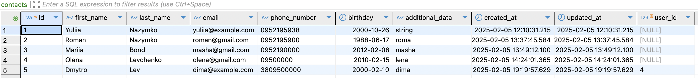
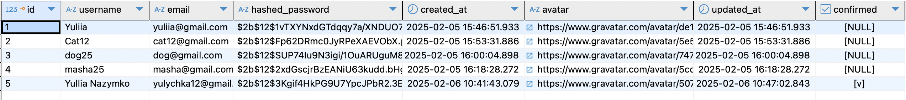
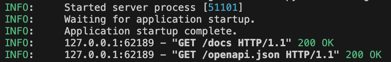
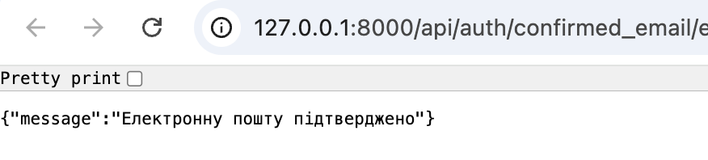
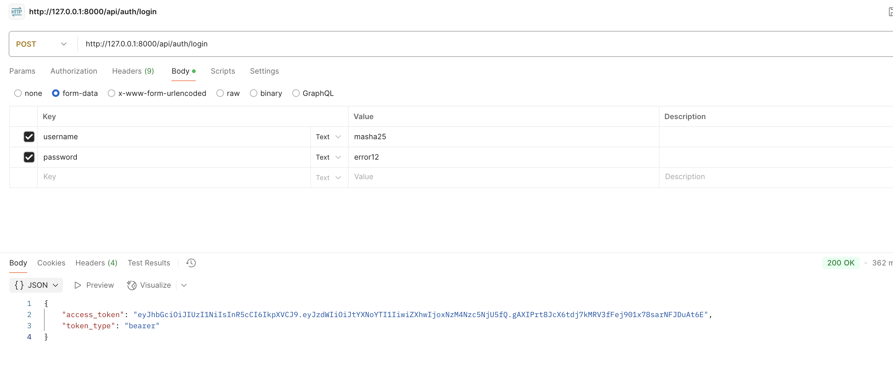

# Тема 10. Домашня робота

У цьому домашньому завданні ви **продовжите допрацьовувати ваш REST
API-застосунок** із попереднього домашнього завдання.

## Технічний опис завдання

- Реалізуйте механізм аутентифікації в застосунку.

- Реалізуйте механізм авторизації за допомогою JWT-токенів, щоб усі операції з
  контактами проводились лише зареєстрованими користувачами.

- Користувач повинен мати доступ лише до своїх операцій з контактами.

- Реалізуйте механізм верифікації електронної пошти зареєстрованого користувача.

- Обмежте кількість запитів до маршруту користувача `/me`.

- Увімкніть CORS для свого REST API.

- Реалізуйте можливість оновлення аватара користувача (використовуйте сервіс
  Cloudinary).

## Загальні вимоги до виконання домашнього завдання

> [!NOTE]
>
> Вимоги до домашнього завдання є обов’язковою умовою оцінювання домашнього
> завдання ментором. Якщо якусь з вимог не виконано, ДЗ відправляється ментором
> на доопрацювання без оцінювання. Якщо вам «тільки уточнити»😉 або ви
> «застопорилися» на якомусь з етапів виконання — звертайтеся до ментора у
> Slack).

1. При реєстрації, якщо користувач вже існує з таким email, сервер має повернути
   помилку HTTP 409 Conflict.
2. Сервер має хешувати пароль і не зберігати його у відкритому вигляді в базі
   даних.
3. У разі успішної реєстрації користувача сервер повинен повернути HTTP-статус
   відповіді 201 Created та дані нового користувача.
4. Для всіх операцій POST(створення нового ресурсу), сервер має повертати статус
   201 Created .
5. При операції POST відбувається аутентифікація користувача, сервер повинен
   приймати запит із даними користувача (ім'я та пароль) у тілі запиту.
6. Якщо користувач не існує або пароль не співпадає, має повертатися помилка
   HTTP 401 Unauthorized.
7. Механізм авторизації за допомогою JWT токенів має бути реалізований через
   токен доступу access_token.
8. Усі змінні середовища повинні зберігатися у файлі .env. Всередині коду не
   повинно бути конфіденційних даних у «чистому» вигляді.
9. Для запуску всіх сервісів і баз даних у застосунку використовується Docker
   Compose.

## Підготовка та завантаження домашнього завдання

1. Створіть публічний репозиторій `goit-pythonweb-hw-10`.
2. Виконайте завдання та відправте його у свій репозиторій.
3. Завантажте робочі файли на свій комп’ютер та прикріпіть їх у LMS у форматі
   `zip`. Назва архіву повинна бути у форматі `ДЗ10_ПІБ`.
4. Прикріпіть посилання на репозиторій `goit-pythonweb-hw-10` та відправте на
   перевірку.

## Формат оцінювання

Оцiнка вiд 0-100

- Реалізація механізму аутентифікації в застосунку оцінюється в 20 балів.
- Реалізація механізму авторизації за допомогою JWT-токенів оцінюється в 20
  балів.
- Реалізація доступу користувача лише до своїх операцій оцінюється в 10 балів.
- Реалізація механізму верифікації електронної пошти оцінюється в 20 балів.
- Обмеження кількості запитів до маршруту користувача /meоцінюється в 10 балів.
- Увімкнення CORS для REST API оцінюється в 5 балів.
- Реалізація можливості оновлення аватара користувача оцінюється в 15 балів.

> [!NOTE]
>
> Якщо є помилки або недоліки виконання, кількість балів зменшується пропорційно
> до наявних помилок на розсуд ментора.
>
> УВАГА!! У вас є можливість обрати підхід до виконання та можливого
> доопрацювання домашнього завдання:
>
> - задовольнитися першою отриманою оцінкою (звісно ж, якщо вона вище прохідного
>   бала),
> - намагатися отримати вищий бал шляхом можливого послідуючого доопрацювання
>   роботи у відповідності з фідбеком ментора.
>
> Обраний підхід до виконання ДЗ необхідно зазначити у полі для здачі до
> прикріпленого завдання. За відсутності коментаря ментор дотримується першого
> підходу й виставляє отриману оцінку.

> [!NOTE]
>
> Відправляйте ДЗ на перевірку, коли зроблено все можливе, оскільки кількість
> спроб здачі завдання впливає на отриманий бал! За кожну наступну спробу після
> другої (тобто з третьої) максимально можлива кількість балів зменшується на 5.
> Таким чином: Критерії оцінювання робіт у магістратурі GoIt Neoversity

## Формат здачі

- Прикріплені файли репозиторію у форматі `zip` з назвою `ДЗ10_ПІБ`.
- Посилання на репозиторій.

### Результати виконаного завдання:

